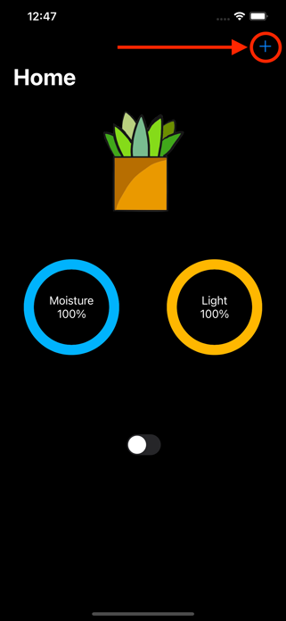
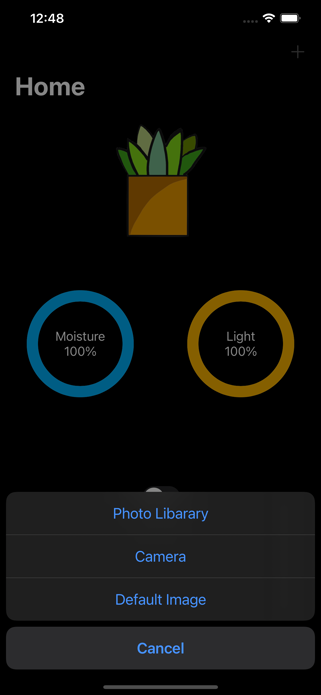
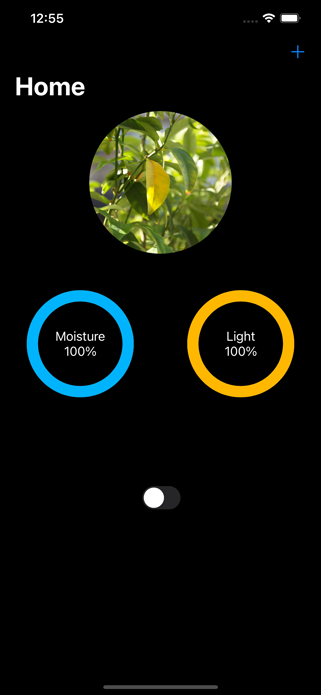
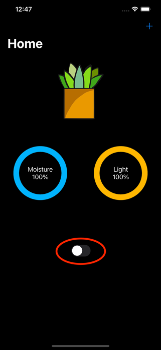

## Download
Arduino Code: [Here](https://github.com/rexhanh/WateringSystem)

Testflight Link: [Here](https://testflight.apple.com/join/eZRCohtQ)
## How to use
Open the app, accept bluetooth usage, and if the device was setup, you are good to go, start to monitor the light intensity and soil moisture!

### Change Your Plant Image
 

### Use the Switch to Control the Pump

## Improvements
1. Add multiple-device support
2. Add custom watering time switch
